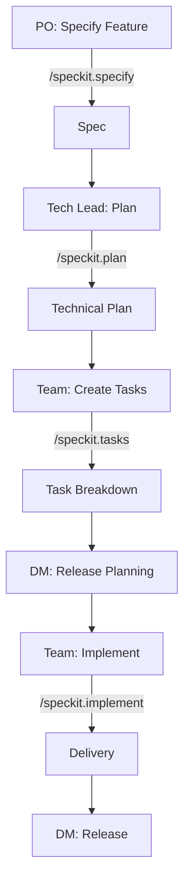

# GitHub Copilot Delivery Manager Guide

A comprehensive guide for Delivery Managers to leverage GitHub Copilot for release planning, risk management, stakeholder reporting, and delivery coordination.

## Table of Contents

- [Overview](#overview)
- [Release Planning](#release-planning)
- [Risk Management](#risk-management)
- [Stakeholder Reporting](#stakeholder-reporting)
- [Team Coordination](#team-coordination)
- [Metrics & Analytics](#metrics--analytics)
- [Real-World Scenarios](#real-world-scenarios)
- [Customizations & Tips](#customizations--tips)

## Overview

As a Delivery Manager, GitHub Copilot helps you:

- **Plan releases**: Create and maintain release schedules
- **Manage risks**: Identify, assess, and mitigate delivery risks
- **Report to stakeholders**: Generate clear status updates and reports
- **Coordinate teams**: Align multiple teams toward delivery goals
- **Track metrics**: Monitor velocity, quality, and predictability

## Release Planning

### Creating Release Plans

```
@workspace "Create release plan for Q2 2025:
Teams: 3 (Platform, Mobile, API)
Major features:
- Platform: Dashboard redesign, Performance optimization
- Mobile: Offline mode, Push notifications
- API: v2 launch, Rate limiting
Dependencies: Platform blocks Mobile; API blocks both
Constraints: Code freeze June 15, major conference demo June 1"
```

**Copilot generates**:

```markdown
# Q2 2025 Release Plan

## Executive Summary

**Release Target**: June 20, 2025
**Code Freeze**: June 15, 2025
**Key Milestone**: Conference Demo - June 1, 2025

### Release Goals
1. Launch redesigned dashboard with improved performance
2. Enable mobile offline functionality
3. General availability of API v2

---

## Timeline Overview

```
        April                   May                    June
   ─────────────────────────────────────────────────────────────
   W1    W2    W3    W4    W1    W2    W3    W4    W1    W2   
   │     │     │     │     │     │     │     │     │     │
   ▼     ▼     ▼     ▼     ▼     ▼     ▼     ▼     ▼     ▼

Platform Team:
   [─── Dashboard Design ───][─── Implementation ───][─ Perf ─]
                                                          ▲
Mobile Team:                                              │
   [── Offline Core ──][─── Push Notif ───][─ Integration ─]
                                                    ▲     │
API Team:                                           │     │
   [── v2 Core ──][─── Rate Limiting ───][─ Doc/Migration ─]
        │                                     │
        └─────────── Dependencies ────────────┘

   Milestones: △ Demo Ready      ★ Code Freeze    ◆ Release
                (Jun 1)           (Jun 15)         (Jun 20)
```

---

## Team Deliverables

### Platform Team

| Deliverable | Start | End | Dependencies | Status |
|-------------|-------|-----|--------------|--------|
| Dashboard design complete | Apr 1 | Apr 14 | None | 🟡 Planning |
| Dashboard implementation | Apr 15 | May 15 | Design | ⚪ Not Started |
| Performance optimization | May 16 | Jun 10 | Dashboard | ⚪ Not Started |
| Demo-ready milestone | Jun 1 | Jun 1 | All above | ⚪ Not Started |

### Mobile Team

| Deliverable | Start | End | Dependencies | Status |
|-------------|-------|-----|--------------|--------|
| Offline mode core | Apr 1 | Apr 21 | None | 🟡 Planning |
| Push notifications | Apr 22 | May 19 | None | ⚪ Not Started |
| Integration with Platform | May 20 | Jun 10 | Platform Dashboard | ⚪ Not Started |

### API Team

| Deliverable | Start | End | Dependencies | Status |
|-------------|-------|-----|--------------|--------|
| API v2 core endpoints | Apr 1 | Apr 28 | None | 🟡 Planning |
| Rate limiting | Apr 29 | May 26 | v2 Core | ⚪ Not Started |
| Documentation & migration | May 27 | Jun 10 | Rate limiting | ⚪ Not Started |

---

## Dependency Map

```
                    ┌─────────────────┐
                    │  API v2 Core    │
                    │   (Apr 1-28)    │
                    └────────┬────────┘
                             │
                             ▼
                    ┌─────────────────┐
                    │  Rate Limiting  │
                    │  (Apr 29-May 26)│
                    └────────┬────────┘
                             │
              ┌──────────────┴──────────────┐
              ▼                              ▼
     ┌─────────────────┐           ┌─────────────────┐
     │ Platform Perf   │           │ Mobile Integ    │
     │  (May 16-Jun10) │           │ (May 20-Jun10)  │
     └────────┬────────┘           └────────┬────────┘
              │                              │
              └──────────────┬───────────────┘
                             ▼
                    ┌─────────────────┐
                    │  DEMO READY     │
                    │    (Jun 1)      │
                    └─────────────────┘
```

---

## Risk Assessment

| Risk | Probability | Impact | Mitigation |
|------|-------------|--------|------------|
| Platform delays block Mobile | Medium | High | Weekly sync meetings, buffer built in |
| API v2 complexity underestimated | Medium | High | Start with core endpoints, defer advanced features |
| Demo readiness concerns | Low | Critical | Hard deadline, daily standups in May |
| Resource conflicts | Low | Medium | Clear ownership, escalation path |

---

## Key Milestones

| Date | Milestone | Success Criteria | Owner |
|------|-----------|------------------|-------|
| Apr 14 | Design Complete | All designs approved | Platform Lead |
| May 1 | API v2 Alpha | Core endpoints working | API Lead |
| Jun 1 | Demo Ready | All features demo-able | Delivery Manager |
| Jun 15 | Code Freeze | No feature PRs after | All Teams |
| Jun 20 | Release | Production deployment | DevOps |

---

## Communication Plan

| Audience | Frequency | Format | Owner |
|----------|-----------|--------|-------|
| Executive team | Bi-weekly | Summary email | Delivery Manager |
| Product team | Weekly | Status meeting | Product Owner |
| Engineering | Daily | Standup | Team Leads |
| Stakeholders | Monthly | Demo | Delivery Manager |
```

### Release Readiness Checklists

```
@workspace "Create release readiness checklist for major release:
Components: Web app, Mobile app, API
Pre-release requirements: QA sign-off, Security scan, Performance test
Include go/no-go criteria"
```

**Copilot generates**:

```markdown
# Release Readiness Checklist

## Release: v2.5.0
## Target Date: June 20, 2025

---

## Go/No-Go Decision Framework

### Automatic NO-GO Conditions
- [ ] Any P0/P1 bugs open
- [ ] Security vulnerabilities unresolved
- [ ] Performance regression > 20%
- [ ] Data migration not tested
- [ ] Rollback procedure not verified

### Go Criteria (All Required)
- [ ] All items in this checklist complete
- [ ] Sign-off from: QA Lead, Security, Product, Engineering
- [ ] Stakeholders notified of release window

---

## Pre-Release Checklist

### Code Readiness

#### Web Application
- [ ] Feature freeze confirmed (no new features merged)
- [ ] All PRs merged to release branch
- [ ] No critical/high bugs in release scope
- [ ] Code review complete on all changes
- [ ] Dependency vulnerabilities resolved

#### Mobile Application
- [ ] iOS build submitted to App Store review
- [ ] Android build uploaded to Play Store
- [ ] Feature parity verified between platforms
- [ ] Offline functionality tested
- [ ] Push notifications tested (staging)

#### API
- [ ] API v2 endpoints documented
- [ ] Backward compatibility verified
- [ ] Rate limiting configured correctly
- [ ] Migration guide published
- [ ] Deprecation notices sent to API consumers

### Testing Sign-Off

| Test Type | Status | Sign-Off | Date |
|-----------|--------|----------|------|
| Unit tests | ⬜ | - | - |
| Integration tests | ⬜ | - | - |
| E2E tests | ⬜ | - | - |
| Performance tests | ⬜ | - | - |
| Security scan | ⬜ | - | - |
| Accessibility audit | ⬜ | - | - |
| Mobile device testing | ⬜ | - | - |

### Performance Validation

- [ ] Load test completed (10x expected traffic)
- [ ] Response time within SLA (p95 < 500ms)
- [ ] No memory leaks detected
- [ ] Database query performance acceptable
- [ ] CDN configuration verified

### Security Checklist

- [ ] SAST scan complete (no critical findings)
- [ ] DAST scan complete (no critical findings)
- [ ] Dependency audit (no known vulnerabilities)
- [ ] Penetration test findings addressed
- [ ] Security team sign-off obtained

---

## Infrastructure Readiness

### Production Environment
- [ ] Infrastructure changes deployed and tested
- [ ] Auto-scaling configured for launch load
- [ ] Database migrations tested in staging
- [ ] Backup verification complete
- [ ] Disaster recovery tested this quarter

### Monitoring & Alerting
- [ ] All dashboards updated for new features
- [ ] Alert thresholds reviewed and adjusted
- [ ] On-call rotation confirmed for release window
- [ ] Incident response runbook updated
- [ ] Log aggregation configured for new services

### Rollback Plan
- [ ] Rollback procedure documented
- [ ] Rollback tested in staging
- [ ] Database rollback scripts prepared
- [ ] Feature flags configured for quick disable
- [ ] Communication template ready for rollback scenario

---

## Documentation & Communication

### Technical Documentation
- [ ] API documentation updated
- [ ] Architecture diagrams current
- [ ] Runbooks updated for operations
- [ ] Known issues documented

### User-Facing Documentation
- [ ] Release notes drafted
- [ ] Help articles updated
- [ ] In-app guidance configured
- [ ] Tutorial videos updated (if applicable)

### Stakeholder Communication
- [ ] Release notification sent (48 hours prior)
- [ ] Customer success briefed
- [ ] Support team trained on new features
- [ ] Marketing materials prepared

---

## Release Day Checklist

### Pre-Deployment (T-4 hours)
- [ ] Final go/no-go meeting held
- [ ] All sign-offs collected
- [ ] War room opened (Slack channel/Zoom)
- [ ] On-call engineer confirmed available

### Deployment (T-0)
- [ ] Deployment initiated
- [ ] Smoke tests run post-deployment
- [ ] Key user flows verified manually
- [ ] Monitoring dashboard watched for anomalies

### Post-Deployment (T+2 hours)
- [ ] Error rates within normal range
- [ ] No customer complaints reported
- [ ] Performance metrics stable
- [ ] Mobile app updates visible in stores

### Post-Deployment (T+24 hours)
- [ ] Full metrics review conducted
- [ ] Any hotfix needs identified
- [ ] Retrospective scheduled
- [ ] Release notes published

---

## Approval Sign-Offs

| Role | Name | Approval | Date |
|------|------|----------|------|
| Engineering Lead | | ⬜ | |
| QA Lead | | ⬜ | |
| Security Lead | | ⬜ | |
| Product Owner | | ⬜ | |
| Delivery Manager | | ⬜ | |
```

### Deployment Planning

```
@workspace "Create deployment runbook for zero-downtime release:
Components: API (3 instances), Web (2 instances), Workers (2 instances)
Database: PostgreSQL with migrations
Strategy: Rolling deployment
Include rollback procedures"
```

## Risk Management

### Risk Identification

```
@workspace "Identify delivery risks for this project:
Project: E-commerce platform migration
Timeline: 6 months
Team: 15 engineers, 3 teams
Complexity: Legacy system integration, data migration, new features
Categorize by: Technical, Resource, Schedule, External"
```

**Copilot generates**:

```markdown
# Risk Register: E-commerce Platform Migration

## Risk Summary

| Category | High | Medium | Low | Total |
|----------|------|--------|-----|-------|
| Technical | 3 | 4 | 2 | 9 |
| Resource | 2 | 3 | 1 | 6 |
| Schedule | 2 | 2 | 1 | 5 |
| External | 1 | 2 | 2 | 5 |
| **Total** | **8** | **11** | **6** | **25** |

---

## High Priority Risks

### RISK-001: Data Migration Integrity
**Category:** Technical | **Probability:** Medium | **Impact:** Critical

**Description:** 
Data migration from legacy Oracle DB to PostgreSQL may result in data loss or corruption, affecting customer orders and financial records.

**Indicators:**
- Migration test failures
- Data validation discrepancies
- Performance degradation in migrated data

**Mitigation Plan:**
1. Implement comprehensive data validation suite
2. Run parallel systems for 2 weeks post-migration
3. Create detailed rollback procedure
4. Engage DBA consultant for complex transformations

**Contingency:**
- Extend parallel run period
- Manual data reconciliation team on standby
- Customer communication plan ready

**Owner:** Data Team Lead
**Review Date:** Bi-weekly

---

### RISK-002: Legacy System Integration Complexity
**Category:** Technical | **Probability:** High | **Impact:** High

**Description:**
Integration with legacy payment and inventory systems may prove more complex than estimated due to undocumented APIs and data formats.

**Indicators:**
- Integration spike reveals undocumented dependencies
- API behavior differs from documentation
- Response time exceeds SLA

**Mitigation Plan:**
1. Conduct thorough API discovery phase (2 weeks)
2. Build comprehensive integration test suite
3. Implement circuit breakers and fallbacks
4. Allocate 30% buffer for integration work

**Contingency:**
- Defer non-critical integrations to phase 2
- Implement manual workarounds for critical flows
- Engage legacy system vendor for support

**Owner:** Integration Team Lead
**Review Date:** Weekly

---

### RISK-003: Key Personnel Dependency
**Category:** Resource | **Probability:** Medium | **Impact:** Critical

**Description:**
Critical knowledge concentrated in 2 senior engineers who understand both legacy and new systems. Loss of either would significantly impact delivery.

**Indicators:**
- Knowledge sharing sessions not occurring
- Documentation gaps in critical areas
- Bus factor = 2 for key components

**Mitigation Plan:**
1. Mandatory pair programming on critical components
2. Weekly knowledge transfer sessions recorded
3. Comprehensive documentation requirements
4. Cross-training plan for 3 additional engineers

**Contingency:**
- Retention bonuses for key personnel
- External contractor identified for emergency
- Scope reduction options identified

**Owner:** Engineering Manager
**Review Date:** Monthly

---

## Medium Priority Risks

### RISK-004: Third-Party Service Outage
**Category:** External | **Probability:** Low | **Impact:** High

**Description:**
Dependency on third-party payment provider (Stripe) and shipping API (FedEx) could cause service disruption during critical periods.

**Mitigation:**
- Implement fallback payment provider
- Cache shipping rate data
- Build retry and circuit breaker patterns

---

### RISK-005: Scope Creep
**Category:** Schedule | **Probability:** High | **Impact:** Medium

**Description:**
Stakeholders may request additional features as they see progress, pushing timeline.

**Mitigation:**
- Strict change control process
- Clear scope document signed off
- Change impact assessments required

---

### RISK-006: Performance Regression
**Category:** Technical | **Probability:** Medium | **Impact:** High

**Description:**
New platform may not meet performance SLAs under peak load.

**Mitigation:**
- Performance testing in each sprint
- Production-like staging environment
- Performance budget per feature

---

## Risk Matrix

```
              │ Critical    High        Medium      Low
──────────────┼─────────────────────────────────────────
High          │             R002        R005
Probability   │             
──────────────┼─────────────────────────────────────────
Medium        │ R001, R003  R006        R007, R008  R009
Probability   │
──────────────┼─────────────────────────────────────────
Low           │             R004        R010        R011
Probability   │
```

---

## Risk Monitoring Schedule

| Frequency | Activities |
|-----------|------------|
| Daily | Check risk indicators in standup |
| Weekly | Risk review in team leads meeting |
| Bi-weekly | Update risk register, report to steering |
| Monthly | Full risk reassessment with stakeholders |
```

### Issue Escalation

```
@workspace "Create escalation matrix for project issues:
Levels: Team Lead → Engineering Manager → Director → VP
Categories: Technical blockers, Resource conflicts, Schedule impacts, External dependencies
Include response times and communication templates"
```

## Stakeholder Reporting

### Status Reports

```
@workspace "Generate weekly status report:
Week: May 5-9, 2025
Sprint: 23 of 26
Completed: 42 story points
Planned: 45 story points
Issues: 2 blockers (API integration, design resource)
Highlights: Dashboard MVP complete, positive user feedback
Format for executive audience"
```

**Copilot generates**:

```markdown
# Weekly Status Report

**Week:** May 5-9, 2025 | **Sprint:** 23 of 26 | **Project:** Platform Modernization

---

## Executive Summary

🟢 **Overall Status: On Track**

Good progress this week with Dashboard MVP completion. Two blockers identified and being actively managed. On track for June 20 release.

---

## Key Metrics

| Metric | This Week | Last Week | Trend |
|--------|-----------|-----------|-------|
| Velocity | 42 pts | 45 pts | ↓ 7% |
| Sprint Burndown | 93% | 100% | ⚠️ |
| Blockers | 2 | 0 | ↑ |
| Bug Count (open) | 8 | 12 | ↓ 33% |
| Release Progress | 65% | 58% | ↑ 7% |

---

## Highlights ✅

1. **Dashboard MVP Complete**
   - All core widgets implemented
   - User testing feedback: 4.5/5 satisfaction
   - Performance targets met (< 2s load time)

2. **API v2 Core Endpoints Shipped**
   - 12 of 15 endpoints live in staging
   - Zero breaking changes from v1
   - Documentation 80% complete

3. **Mobile Offline Mode**
   - Core functionality working on both platforms
   - Beta testing began with 50 internal users

---

## Blockers & Risks 🚨

### Blocker 1: Third-Party API Integration
**Impact:** High | **Resolution ETA:** May 12

**Issue:** Partner payment API returning inconsistent responses
**Action:** Escalated to partner; workaround in development
**Owner:** API Team Lead

### Blocker 2: Design Resource Constraint
**Impact:** Medium | **Resolution ETA:** May 14

**Issue:** UI designer on leave, mobile screens delayed
**Action:** Temporary contractor engaged, starting Monday
**Owner:** Engineering Manager

---

## Upcoming Week Focus

| Team | Priority | Target |
|------|----------|--------|
| Platform | Performance optimization | 30% improvement |
| Mobile | Push notification integration | Feature complete |
| API | Rate limiting implementation | Ready for staging |

---

## Decision Needed

**Feature Scope Decision Required by May 15**

Advanced analytics feature is 2 weeks behind. Options:
1. Defer to next release (Recommended)
2. Add 2 weeks to timeline
3. Reduce scope to basic analytics

**Recommendation:** Option 1 - Defer to maintain release date

---

## Release Timeline

```
Current ────────●─────────────────────────────────────►
                ↑
           Week 23    Week 24    Week 25    Week 26   Release
           May 5-9    May 12-16  May 19-23  May 26-30 Jun 20
              │           │          │          │        │
              │    Code Complete     │    Code Freeze    │
              │           ▼          │          ▼        │
              └───────────────────────────────────────────┘
                        [████████████░░░░░░] 65%
```

---

## Appendix: Detailed Metrics

| Story | Points | Status | Notes |
|-------|--------|--------|-------|
| Dashboard widgets | 13 | ✅ Complete | Ahead of schedule |
| Performance tuning | 8 | 🔄 In Progress | On track |
| API rate limiting | 8 | 🔄 In Progress | Minor delays |
| Mobile offline | 5 | ✅ Complete | |
| Push notifications | 8 | ⚪ Not Started | Starts Monday |
```

### Stakeholder Presentations

```
@workspace "Create quarterly business review presentation:
Topics:
- Q1 delivery performance
- Key achievements
- Challenges and learnings
- Q2 outlook
Audience: VP Engineering, Product Directors, Finance
Format: 15-slide presentation outline"
```

### Executive Dashboards

```
@workspace "Design executive dashboard showing:
- Release progress (burnup chart)
- Team velocity trends
- Quality metrics (bug trends, test coverage)
- Risk status
- Resource utilization
Include KPI definitions and thresholds"
```

## Team Coordination

### Cross-Team Dependencies

```
@workspace "Create dependency tracking system:
Teams: Platform, Mobile, API, Infrastructure
Common dependencies: Shared libraries, APIs, Infrastructure
Include: RACI matrix, communication cadence, escalation paths"
```

**Copilot generates**:

```markdown
# Cross-Team Dependency Management

## Team Overview

| Team | Lead | Focus | Key Outputs |
|------|------|-------|-------------|
| Platform | Alex | Web application | UI components, dashboards |
| Mobile | Jordan | iOS/Android apps | Native apps, offline |
| API | Sam | Backend services | REST APIs, data layer |
| Infrastructure | Morgan | DevOps, SRE | Pipelines, hosting |

---

## Dependency Matrix

```
              Platform    Mobile     API     Infrastructure
Platform         -         APIs      APIs     Deployment
Mobile         SSO lib      -        APIs     App stores
API            None       None        -       Databases
Infrastructure None       None      None         -
```

### Key Dependencies

| ID | From | To | Dependency | Criticality | Status |
|----|------|-----|------------|-------------|--------|
| DEP-001 | Mobile | API | User auth endpoints | Critical | 🟢 Delivered |
| DEP-002 | Platform | API | Dashboard data APIs | Critical | 🟡 In Progress |
| DEP-003 | Mobile | Platform | SSO shared library | High | 🟢 Delivered |
| DEP-004 | API | Infra | PostgreSQL upgrade | Critical | 🟡 Scheduled |
| DEP-005 | Platform | Infra | CDN configuration | Medium | ⚪ Not Started |

---

## RACI Matrix

| Activity | Platform | Mobile | API | Infra | PM |
|----------|----------|--------|-----|-------|-----|
| API contract definition | C | C | R/A | I | I |
| Shared library updates | R | C | C | I | I |
| Database schema changes | C | I | R/A | C | I |
| Infrastructure changes | I | I | C | R/A | I |
| Release coordination | C | C | C | C | R/A |
| Incident response | C | C | R | A | I |

R = Responsible, A = Accountable, C = Consulted, I = Informed

---

## Communication Cadence

### Standing Meetings

| Meeting | Frequency | Attendees | Purpose |
|---------|-----------|-----------|---------|
| Dependency Sync | Weekly, Tue 10am | Team Leads | Review blockers, upcoming deps |
| Tech Leads Forum | Bi-weekly, Wed 2pm | Tech Leads | Architecture alignment |
| Release Planning | Monthly, 1st Fri | All Leads + PM | Quarter planning |

### Async Communication

| Channel | Purpose | Response Time |
|---------|---------|---------------|
| #cross-team-deps | Dependency requests | 4 hours |
| #tech-decisions | Architecture discussions | 24 hours |
| #release-coord | Release activities | 2 hours |
| Email | Formal requests | 24 hours |

---

## Dependency Request Process

```
        ┌─────────────────┐
        │ Identify Need   │
        │ (Requesting)    │
        └────────┬────────┘
                 ▼
        ┌─────────────────┐
        │ Log in Tracker  │
        │ DEP-XXX         │
        └────────┬────────┘
                 ▼
        ┌─────────────────┐
        │ Review in Sync  │
        │ (Weekly Tue)    │
        └────────┬────────┘
                 ▼
        ┌─────────────────┐
        │ Providing Team  │
        │ Commits Date    │
        └────────┬────────┘
                 ▼
        ┌─────────────────┐
        │ Track to        │
        │ Completion      │
        └─────────────────┘
```

### Dependency Request Template

```markdown
## New Dependency Request

**ID:** DEP-XXX
**From Team:** [Requesting team]
**To Team:** [Providing team]

**What is needed:**
[Clear description of the deliverable]

**Why it's needed:**
[Business/technical justification]

**When it's needed:**
[Date with justification]

**Impact if delayed:**
[Consequences of late delivery]

**Contact:** [Name and channel]
```

---

## Escalation Path

### Escalation Levels

| Level | Trigger | Owner | Response Time |
|-------|---------|-------|---------------|
| L1 | Dependency at risk | Team Leads | 24 hours |
| L2 | Dependency missed | Engineering Managers | 4 hours |
| L3 | Critical blocker | Director | 2 hours |
| L4 | Release at risk | VP Engineering | 1 hour |

### Escalation Template

```markdown
## Dependency Escalation

**Dependency ID:** DEP-XXX
**Escalation Level:** L2
**Date:** [Today's date]

**Current Status:**
[What's happening]

**Impact:**
[What's blocked and business impact]

**Root Cause:**
[Why it's delayed]

**Options:**
1. [Option A with trade-offs]
2. [Option B with trade-offs]
3. [Option C with trade-offs]

**Recommended Action:**
[Your recommendation]

**Decision Needed By:**
[Date and time]
```
```

### Capacity Planning

```
@workspace "Plan capacity for Q3:
Available: 3 teams, 15 engineers total
Committed: Maintenance (20%), Technical debt (15%), On-call (10%)
Requested features: 150 story points
Historical velocity: 35 points/sprint
Calculate available capacity and recommendations"
```

## Metrics & Analytics

### Velocity Analysis

```
@workspace "Analyze team velocity data:
Last 6 sprints: 42, 38, 45, 40, 35, 42
Team changes: 1 person added sprint 3, 1 left sprint 5
Provide: Trend analysis, normalized velocity, recommendations"
```

**Copilot analyzes**:

```markdown
## Velocity Analysis Report

### Raw Data

| Sprint | Velocity | Team Size | Notes |
|--------|----------|-----------|-------|
| 18 | 42 pts | 5 | Baseline |
| 19 | 38 pts | 5 | Holiday sprint |
| 20 | 45 pts | 6 | +1 engineer |
| 21 | 40 pts | 6 | Normal |
| 22 | 35 pts | 5 | -1 engineer |
| 23 | 42 pts | 5 | Recovery |

### Analysis

**Overall Trend:** Stable with explainable variations

```
50 │                    ●
   │     ●              
40 │ ●              ●       ●
   │         ●                   
30 │                    
   │
   └──────────────────────────────
     S18  S19  S20  S21  S22  S23
```

### Normalized Velocity (per engineer)

| Sprint | Total Velocity | Team Size | Per Person |
|--------|---------------|-----------|------------|
| 18 | 42 | 5 | 8.4 pts |
| 19 | 38 | 5 | 7.6 pts |
| 20 | 45 | 6 | 7.5 pts |
| 21 | 40 | 6 | 6.7 pts |
| 22 | 35 | 5 | 7.0 pts |
| 23 | 42 | 5 | 8.4 pts |

**Average per engineer:** 7.6 points/sprint
**Standard deviation:** 0.65 points

### Key Findings

1. **Holiday Impact (S19):** -10% velocity, expected and recoverable

2. **New Team Member (S20-21):** 
   - Initial boost (extra hands)
   - Followed by dip (onboarding tax)
   - Suggests 2-sprint ramp-up period

3. **Team Member Departure (S22):**
   - Immediate -12.5% impact
   - Quick recovery by S23
   - Knowledge transfer was effective

### Recommendations

1. **Planning Basis:** Use 40 points/sprint for 5-person team
   - Conservative estimate
   - Accounts for normal variation

2. **Team Changes:** 
   - Budget 2 sprints for new member productivity
   - Plan for 1 sprint impact on departures

3. **Capacity Planning:**
   ```
   Team of 5: 40 pts/sprint (sustainable)
   Team of 6: 45-48 pts/sprint (after ramp-up)
   Team of 4: 32 pts/sprint (expected)
   ```

4. **Forecast for Next Quarter (6 sprints):**
   - Pessimistic: 36 × 6 = 216 points
   - Expected: 40 × 6 = 240 points
   - Optimistic: 44 × 6 = 264 points
```

### Quality Metrics

```
@workspace "Create quality metrics dashboard:
Track: Bug escape rate, Test coverage, MTTR, Customer-reported issues
Include: Trend charts, thresholds, action triggers"
```

### Predictability Metrics

```
@workspace "Analyze delivery predictability:
Data: Last 12 sprints of planned vs delivered
Calculate: Commitment reliability, variance, predictability index
Suggest improvements"
```

## Real-World Scenarios

### Scenario 1: Release at Risk

**Context**: Two weeks to release, critical feature incomplete

```
@workspace "Create recovery plan:
Situation: Feature 60% complete, 2 weeks to release, 4 weeks work remaining
Options: Delay release, reduce scope, add resources
Constraints: Marketing campaign scheduled, team already at capacity
Analyze options and recommend approach"
```

### Scenario 2: Resource Conflict

**Context**: Two projects need the same engineer

```
@workspace "Resolve resource conflict:
Engineer: Sarah (senior backend)
Project A: API migration (needs 80% of her time)
Project B: Performance optimization (needs 50% of her time)
Both projects are critical for Q2
Provide options and recommendation"
```

### Scenario 3: Stakeholder Expectation Management

**Context**: Stakeholder requesting major scope change

```
@workspace "Prepare impact analysis:
Current scope: 150 story points, 6 sprints
Requested addition: 40 story points
Team velocity: 35 points/sprint
Create impact analysis with options for stakeholder discussion"
```

## Customizations & Tips

### Delivery Manager Copilot Instructions

```markdown
# Delivery Manager Copilot Instructions

## Reporting Style
- Lead with status indicators (🟢🟡🔴)
- Use executive summaries
- Include concrete metrics
- Highlight decisions needed

## Risk Management
- Quantify probability and impact
- Always include mitigation plans
- Track leading indicators

## Planning
- Use data-driven estimates
- Include buffer for unknowns
- Consider dependencies explicitly
- Plan for team capacity constraints
```

### Useful Prompts for Delivery Managers

| Task | Prompt |
|------|--------|
| Release plan | "Create release plan for [features] with [teams] and [constraints]" |
| Risk register | "Identify delivery risks for [project] with [context]" |
| Status report | "Generate status report for [week] with [metrics] for [audience]" |
| Dependency tracking | "Create dependency matrix for [teams] with [deliverables]" |
| Capacity planning | "Plan capacity for [period] with [resources] and [commitments]" |
| Impact analysis | "Analyze impact of [change] on [project timeline]" |

### Integration with SpecKit Workflow



### Key Metrics to Track

| Category | Metric | Target | Action Threshold |
|----------|--------|--------|------------------|
| Predictability | Commitment reliability | >85% | <75% |
| Quality | Bug escape rate | <5% | >10% |
| Velocity | Sprint completion | >90% | <80% |
| Dependencies | Blocked time | <10% | >20% |
| Risk | Open high risks | <3 | >5 |

---

[Back to Cookbook](../README.md) | [Engineering Lead Guide](./engineering-lead-guide.md) | [Developer Guide](./developer-guide.md)
