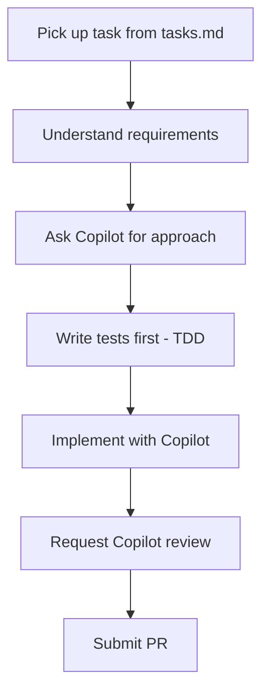

# GitHub Copilot Developer Guide

A comprehensive guide for software developers to maximize productivity with GitHub Copilot across all development activities.

## Table of Contents

- [Overview](#overview)
- [Development Workflow Integration](#development-workflow-integration)
- [Code Generation Patterns](#code-generation-patterns)
- [Debugging with Copilot](#debugging-with-copilot)
- [Testing Best Practices](#testing-best-practices)
- [Pull Request Reviews](#pull-request-reviews)
- [Real-World Scenarios](#real-world-scenarios)
- [Customizations & Tips](#customizations--tips)

## Overview

As a developer, GitHub Copilot becomes your AI pair programmer. This guide covers:

- **Code generation**: From simple functions to complex architectures
- **Debugging assistance**: Understanding and fixing issues faster
- **Test writing**: Comprehensive test coverage with less effort
- **Code reviews**: AI-assisted quality improvements
- **Documentation**: Auto-generated docs and comments

## Development Workflow Integration

### Daily Development Cycle



### Integrating with SpecKit Commands

#### Starting Implementation

```bash
# View your assigned tasks
cat .specify/specs/123-user-auth/tasks.md

# Check the implementation plan for context
cat .specify/specs/123-user-auth/plan.md

# Begin implementation
/speckit.implement
```

#### Task Execution Pattern

1. **Read the task specification**
   ```
   @workspace "Explain task T012: Create User model in src/models/user.py"
   ```

2. **Generate the implementation**
   ```
   @workspace "Implement the User model following our data-model.md specification"
   ```

3. **Write tests**
   ```
   @workspace "Generate unit tests for the User model covering all validation rules"
   ```

## Code Generation Patterns

### Pattern 1: Function Generation

**Prompt Style**: Describe intent, inputs, outputs, and edge cases

```python
# Generate a function that validates and parses ISO 8601 date strings
# Input: date string (e.g., "2024-01-15T10:30:00Z")
# Output: datetime object or None if invalid
# Handle: timezone awareness, invalid formats, empty strings
def parse_iso_date(date_string: str) -> datetime | None:
    # Copilot generates implementation
```

**Real Example**:
```typescript
// Create an async function to fetch user data with retry logic
// - Max 3 retries with exponential backoff
// - Handle network errors and 5xx responses
// - Return null if all retries fail
// - Log each retry attempt
async function fetchUserWithRetry(userId: string): Promise<User | null> {
    // Copilot generates:
    const maxRetries = 3;
    let lastError: Error | null = null;
    
    for (let attempt = 1; attempt <= maxRetries; attempt++) {
        try {
            const response = await fetch(`/api/users/${userId}`);
            if (response.ok) {
                return await response.json();
            }
            if (response.status >= 500) {
                throw new Error(`Server error: ${response.status}`);
            }
            return null; // Client error, don't retry
        } catch (error) {
            lastError = error as Error;
            console.log(`Attempt ${attempt} failed: ${error.message}`);
            if (attempt < maxRetries) {
                await new Promise(resolve => 
                    setTimeout(resolve, Math.pow(2, attempt) * 1000)
                );
            }
        }
    }
    console.error(`All retries failed for user ${userId}`, lastError);
    return null;
}
```

### Pattern 2: Class Generation

**Prompt Style**: Define responsibilities, methods, and relationships

```python
# Create a UserService class that:
# - Manages user CRUD operations
# - Uses repository pattern for data access
# - Implements password hashing with bcrypt
# - Publishes events for user creation/deletion
# - Handles validation using Pydantic models
class UserService:
    # Copilot generates complete class
```

### Pattern 3: API Endpoint Generation

**Prompt Style**: Specify route, HTTP method, request/response formats, validation

```typescript
// POST /api/orders endpoint
// Request body: { productIds: string[], shippingAddress: Address }
// Response: 201 with Order object or 400 with validation errors
// Validate: product IDs exist, address is complete
// Side effects: Create order, reserve inventory, send confirmation email
@Post('/orders')
async createOrder(@Body() request: CreateOrderRequest): Promise<Order> {
    // Copilot generates implementation
}
```

### Pattern 4: Database Operations

**Prompt Style**: Define schema, relationships, and query requirements

```sql
-- Create a query that finds all orders for a customer
-- Include: order items, product details, shipping status
-- Filter: last 30 days, exclude cancelled orders
-- Sort: most recent first
-- Optimize: use appropriate indexes

SELECT 
    o.id,
    o.created_at,
    o.status,
    -- Copilot completes the query
```

### Pattern 5: Configuration Generation

**Prompt Style**: Specify environment, requirements, and constraints

```yaml
# GitHub Actions workflow for Node.js application
# - Run on push to main and PRs
# - Test with Node 18, 20, 22
# - Cache npm dependencies
# - Run linting, tests, and build
# - Deploy to staging on main branch merge

name: CI/CD Pipeline
# Copilot generates complete workflow
```

## Debugging with Copilot

### Understanding Errors

**Scenario**: You encounter a cryptic error message

```
@workspace /explain "TypeError: Cannot read property 'map' of undefined at UserList.render"
```

**Copilot Response**:
- Explains the error context
- Identifies likely causes
- Suggests fixes with code examples

### Analyzing Stack Traces

```
@workspace "Analyze this stack trace and suggest fixes:

Error: Connection refused
    at TCPConnectWrap.afterConnect [as oncomplete] (net.js:1141:16)
    at Protocol._enqueue (/app/node_modules/mysql/lib/protocol/Protocol.js:144:48)
    at Connection.query (/app/node_modules/mysql/lib/Connection.js:198:25)
    at UserRepository.findById (/app/src/repositories/user.ts:42:22)"
```

### Interactive Debugging Session

```python
# Debug: This function sometimes returns incorrect totals
def calculate_cart_total(items: list[CartItem]) -> Decimal:
    total = Decimal('0')
    for item in items:
        total += item.price * item.quantity
    return total

# Ask Copilot: "Review this function for edge cases and potential bugs"
# Copilot identifies: floating point issues, null items, negative quantities
```

### Fix Suggestions

```typescript
// This code has a memory leak - help me find and fix it
class DataProcessor {
    private listeners: Function[] = [];
    
    subscribe(callback: Function) {
        this.listeners.push(callback);
    }
    
    process(data: any) {
        this.listeners.forEach(fn => fn(data));
    }
}

// Ask: @workspace /fix "Add proper cleanup to prevent memory leaks"
```

## Testing Best Practices

### Test-Driven Development (TDD) Workflow

```typescript
// Step 1: Describe what you're testing
// Write tests for a password validator that:
// - Requires minimum 8 characters
// - Requires at least one uppercase letter
// - Requires at least one number
// - Requires at least one special character
// - Returns specific error messages for each failure

describe('PasswordValidator', () => {
    // Copilot generates comprehensive test cases
    
    it('should reject passwords shorter than 8 characters', () => {
        const result = validatePassword('Short1!');
        expect(result.valid).toBe(false);
        expect(result.errors).toContain('Password must be at least 8 characters');
    });
    
    it('should reject passwords without uppercase letters', () => {
        const result = validatePassword('lowercase1!');
        expect(result.valid).toBe(false);
        expect(result.errors).toContain('Password must contain at least one uppercase letter');
    });
    
    // ... more test cases generated by Copilot
});
```

### Generating Test Fixtures

```typescript
// Generate realistic test data for user registration tests
// Include: valid users, edge cases, international names, various email formats

const testUsers = [
    // Copilot generates:
    { name: 'John Smith', email: 'john@example.com', age: 30 },
    { name: 'María García', email: 'maria.garcia@empresa.es', age: 25 },
    { name: "O'Brien", email: 'obrien+test@company.co.uk', age: 45 },
    { name: '日本太郎', email: 'taro@日本.jp', age: 35 },
    { name: '', email: 'empty-name@test.com', age: 0 }, // Edge case
];
```

### Integration Test Generation

```typescript
// Generate integration tests for the user registration API endpoint
// Test scenarios:
// - Successful registration
// - Duplicate email handling
// - Invalid input validation
// - Rate limiting behavior
// - Database transaction rollback on failure

describe('POST /api/users/register', () => {
    // Copilot generates complete integration test suite
});
```

### Mock Generation

```typescript
// Generate mocks for external services used by PaymentService
// Services: Stripe API, Email service, Audit logger

const mockStripe = {
    charges: {
        create: jest.fn().mockResolvedValue({
            id: 'ch_mock123',
            status: 'succeeded',
            amount: 1000
        })
    },
    refunds: {
        create: jest.fn().mockResolvedValue({
            id: 'rf_mock456',
            status: 'succeeded'
        })
    }
};
```

## Pull Request Reviews

### Using Copilot for Code Review

#### Self-Review Before Submitting

```
@workspace "Review my changes for:
- Potential bugs
- Security vulnerabilities
- Performance issues
- Code style violations
- Missing error handling"
```

#### Reviewing Others' PRs

```
@workspace "Analyze this diff and identify:
- Breaking changes
- API contract changes
- Test coverage gaps
- Documentation needs"
```

### PR Description Generation

```markdown
<!-- Ask Copilot: "Generate a PR description for my changes" -->

## Summary
This PR implements user authentication with JWT tokens.

## Changes
- Added `AuthService` class with login/logout methods
- Created JWT token generation and validation utilities
- Implemented authentication middleware
- Added unit tests with 95% coverage

## Testing
- [ ] Unit tests pass
- [ ] Integration tests pass
- [ ] Manual testing completed

## Screenshots
(if applicable)
```

### Commit Message Generation

```
@workspace "Generate a conventional commit message for my staged changes"

# Copilot generates:
feat(auth): implement JWT-based user authentication

- Add AuthService with login, logout, and refresh token methods
- Create JWT utility functions for token signing and verification
- Implement Express middleware for protected routes
- Add comprehensive unit tests

Closes #123
```

## Real-World Scenarios

### Scenario 1: Building a REST API from Scratch

**Context**: You're tasked with building a user management API

```bash
# Step 1: Review the specification
cat .specify/specs/001-user-api/spec.md

# Step 2: Check the technical plan
cat .specify/specs/001-user-api/plan.md

# Step 3: Start implementation
/speckit.implement
```

**Copilot Interactions**:

```typescript
// Ask: "Create the Express app structure following our plan.md"
// Then: "Implement the User model with Prisma schema"
// Then: "Create the UserService with CRUD operations"
// Then: "Generate REST endpoints for user management"
// Finally: "Write comprehensive tests for all endpoints"
```

### Scenario 2: Debugging Production Issue

**Context**: Users report intermittent 500 errors on checkout

```typescript
// Step 1: Understand the error
@workspace "Explain this production error:
Error: Transaction timeout after 30000ms
    at PaymentProcessor.process (src/services/payment.ts:142)
"

// Step 2: Get fix suggestions
@workspace "/fix Implement retry logic and timeout handling for payment processing"

// Step 3: Generate tests for the fix
@workspace "Generate tests that simulate timeout scenarios in payment processing"
```

### Scenario 3: Refactoring Legacy Code

**Context**: You need to modernize a legacy module

```javascript
// Old code to refactor
function processData(data, callback) {
    var result = [];
    for (var i = 0; i < data.length; i++) {
        if (data[i].active == true) {
            result.push({
                id: data[i].id,
                name: data[i].name,
                timestamp: new Date().getTime()
            });
        }
    }
    callback(null, result);
}

// Ask Copilot: "Refactor this to modern TypeScript with:
// - Async/await pattern
// - Proper typing
// - Immutable operations
// - Error handling"
```

### Scenario 4: Adding a New Feature to Existing Codebase

**Context**: Add notification preferences to user profile

```typescript
// Step 1: Understand existing code
@workspace "Show me how user preferences are currently stored and retrieved"

// Step 2: Design the addition
@workspace "Suggest how to add notification preferences following our existing patterns"

// Step 3: Implement
// Ask: "Add notification preferences to the User model:
// - Email notifications (on/off)
// - Push notifications (on/off)
// - Notification frequency (immediate/daily/weekly)
// - Quiet hours (start time, end time)"

// Step 4: Update related services
@workspace "Update UserService to handle notification preference updates"
```

## Customizations & Tips

### VS Code Settings for Developers

```json
{
    "github.copilot.enable": {
        "*": true,
        "plaintext": false,
        "markdown": true,
        "yaml": true
    },
    "github.copilot.inlineSuggest.enable": true,
    "editor.inlineSuggest.enabled": true,
    "editor.tabCompletion": "on"
}
```

### Custom Instructions for Your Project

Create `.github/copilot-instructions.md`:

```markdown
# Project-Specific Copilot Instructions

## Tech Stack
- TypeScript 5.x with strict mode
- Express.js for REST APIs
- Prisma ORM with PostgreSQL
- Jest for testing

## Coding Standards
- Use named exports, not default exports
- Prefer composition over inheritance
- Use dependency injection
- Follow repository pattern for data access

## Naming Conventions
- PascalCase for classes and interfaces
- camelCase for functions and variables
- SCREAMING_SNAKE_CASE for constants
- Use descriptive names, avoid abbreviations

## Error Handling
- Use custom error classes extending BaseError
- Always include error codes and messages
- Log errors with structured logging
- Never expose internal errors to clients
```

### Keyboard Shortcuts

| Action | Windows/Linux | macOS |
|--------|---------------|-------|
| Accept suggestion | Tab | Tab |
| Reject suggestion | Esc | Esc |
| Next suggestion | Alt+] | Option+] |
| Previous suggestion | Alt+[ | Option+[ |
| Open Copilot Chat | Ctrl+Shift+I | Cmd+Shift+I |
| Inline Chat | Ctrl+I | Cmd+I |

### Productivity Tips

1. **Comment-driven development**: Write detailed comments describing what you need, then let Copilot implement

2. **Iterative refinement**: Accept partial suggestions, then ask for improvements

3. **Context loading**: Open relevant files in tabs to give Copilot more context

4. **Use @workspace**: Leverage project-wide context for accurate suggestions

5. **Chain prompts**: Build complex implementations step by step

```typescript
// Step 1: "Create the interface"
interface OrderProcessor { /* Copilot generates */ }

// Step 2: "Implement the interface"
class OrderProcessorImpl implements OrderProcessor { /* Copilot generates */ }

// Step 3: "Add error handling"
// Copilot enhances with try-catch, logging, etc.

// Step 4: "Generate tests"
// Copilot creates comprehensive test suite
```

## Troubleshooting

### Common Issues

| Issue | Solution |
|-------|----------|
| Suggestions not appearing | Check Copilot is enabled in settings |
| Irrelevant suggestions | Add more context via comments or @workspace |
| Slow responses | Check network connection, reduce open tabs |
| Outdated patterns | Update custom instructions, provide examples |

### Getting Better Suggestions

1. **Be specific**: Include types, constraints, and edge cases in prompts
2. **Provide examples**: Show Copilot the pattern you want to follow
3. **Use the right scope**: @workspace for project context, inline for local
4. **Iterate**: Refine prompts based on initial suggestions

---

[Back to Cookbook](../README.md) | [QA Guide](./qa-guide.md) | [PM Guide](./pm-guide.md)
