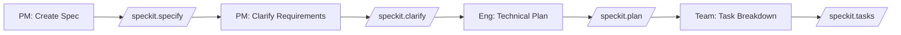

# GitHub Copilot Product Manager Guide

A comprehensive guide for Product Managers to leverage GitHub Copilot for requirements gathering, documentation, roadmap planning, and stakeholder communication.

## Table of Contents

- [Overview](#overview)
- [Requirements Management](#requirements-management)
- [Documentation Creation](#documentation-creation)
- [Roadmap Planning](#roadmap-planning)
- [Stakeholder Communication](#stakeholder-communication)
- [Market Analysis](#market-analysis)
- [Real-World Scenarios](#real-world-scenarios)
- [Customizations & Tips](#customizations--tips)

## Overview

As a Product Manager, GitHub Copilot helps you:

- **Document requirements**: Create clear, comprehensive specifications
- **Write user stories**: Generate well-structured stories with acceptance criteria
- **Plan roadmaps**: Organize features and create release plans
- **Communicate with stakeholders**: Draft PRDs, reports, and presentations
- **Analyze competition**: Research and document market insights

## Requirements Management

### Generating Product Requirements Documents (PRDs)

```
@workspace "Create a PRD template for a new feature:
Feature: User Dashboard Redesign
Goals: Improve user engagement, reduce time-to-value
Target users: Free tier users, Enterprise admins
Key metrics: Session duration, Feature adoption rate"
```

**Copilot generates**:

```markdown
# Product Requirements Document: User Dashboard Redesign

## Executive Summary

### Problem Statement
Current dashboard has low engagement (avg 2.3 minutes per session) and 
users struggle to find key features, leading to reduced activation rates.

### Proposed Solution
Redesigned dashboard with personalized widgets, improved navigation, 
and contextual onboarding to guide users to high-value features.

### Success Metrics
- Increase average session duration from 2.3 to 5+ minutes
- Improve feature discovery rate by 40%
- Reduce support tickets related to "finding features" by 50%

## Background & Context

### Current State
- Dashboard last updated 18 months ago
- User feedback indicates confusion about feature locations
- Analytics show 60% of users only use 2 of 10 available features

### Market Context
- Competitors have introduced personalized dashboards
- User expectations have evolved toward customizable interfaces

## User Personas

### Free Tier User
- Goal: Quickly accomplish basic tasks
- Pain point: Overwhelmed by feature complexity
- Need: Simplified view with guided progression

### Enterprise Admin
- Goal: Monitor team activity and usage
- Pain point: Important metrics buried in menus
- Need: Customizable widgets with real-time data

## Functional Requirements

### Core Features (P0)
1. **Personalized Widget Layout**
   - Users can drag-and-drop widgets
   - System saves layout preferences
   - Default layout based on user segment

2. **Quick Actions Panel**
   - Surface most-used actions
   - Learn from user behavior
   - Keyboard shortcuts support

### Enhanced Features (P1)
1. **Contextual Onboarding**
   - Progressive disclosure of features
   - Achievement-based progression
   - Skip option for experienced users

## Timeline & Milestones

| Phase | Duration | Deliverables |
|-------|----------|--------------|
| Discovery | 2 weeks | User research, competitive analysis |
| Design | 3 weeks | Wireframes, prototypes, user testing |
| Development | 6 weeks | MVP implementation |
| Beta | 2 weeks | Limited rollout, feedback collection |
| Launch | 1 week | Full rollout, monitoring |

## Risks & Mitigations

| Risk | Impact | Mitigation |
|------|--------|------------|
| User resistance to change | High | Opt-in beta, gradual rollout |
| Performance impact | Medium | Load testing, optimization sprints |
| Feature scope creep | High | Clear P0/P1/P2 prioritization |
```

### Writing User Stories with Copilot

```
@workspace "Generate user stories for the authentication feature:
- Login with email/password
- Social login (Google, GitHub)
- Password reset
- Account security (2FA)
Include acceptance criteria for each story"
```

**Copilot generates**:

```markdown
## User Stories: Authentication System

### US-001: Login with Email/Password
**As a** registered user
**I want to** log in with my email and password
**So that** I can access my account securely

**Acceptance Criteria:**
1. Given I am on the login page
   When I enter valid email and password
   Then I should be logged in and redirected to dashboard

2. Given I am on the login page
   When I enter invalid credentials
   Then I should see an error message "Invalid email or password"
   And my password field should be cleared

3. Given I have failed login 5 times
   When I attempt another login
   Then my account should be locked for 15 minutes
   And I should see instructions to wait or reset password

**Technical Notes:**
- Rate limiting: 5 attempts per 15 minutes
- Password not echoed in logs
- Session expires after 24 hours of inactivity

---

### US-002: Social Login (Google)
**As a** new or existing user
**I want to** log in using my Google account
**So that** I can access the app without creating a new password

**Acceptance Criteria:**
1. Given I click "Continue with Google"
   When I authorize the app in Google's popup
   Then I should be logged in with my Google profile info

2. Given my Google email matches an existing account
   When I complete Google OAuth
   Then my accounts should be linked
   And I should be logged into my existing account

3. Given Google OAuth fails
   When the error is returned
   Then I should see a friendly error message
   And be offered alternative login methods

---

### US-003: Password Reset
**As a** user who forgot my password
**I want to** reset my password via email
**So that** I can regain access to my account

**Acceptance Criteria:**
1. Given I click "Forgot Password"
   When I enter my registered email
   Then I should receive a reset email within 2 minutes

2. Given I have a valid reset link
   When I click it within 1 hour
   Then I should be able to set a new password

3. Given my reset link has expired
   When I click it
   Then I should see "Link expired" message
   And be offered to request a new link

---

### US-004: Two-Factor Authentication
**As a** security-conscious user
**I want to** enable 2FA on my account
**So that** my account has an additional layer of protection

**Acceptance Criteria:**
1. Given I am in security settings
   When I enable 2FA
   Then I should see a QR code for authenticator apps
   And receive backup codes for account recovery

2. Given 2FA is enabled
   When I log in with correct credentials
   Then I should be prompted for my 2FA code
   And only granted access after valid code entry

3. Given I lost my 2FA device
   When I enter a backup code
   Then I should gain access
   And that backup code should be invalidated
```

### Prioritization Frameworks

```
@workspace "Help me prioritize these features using RICE framework:
1. Dashboard redesign
2. Mobile app
3. API integrations
4. Advanced reporting
5. Team collaboration features

Provide scores and recommendations"
```

**Copilot generates prioritization matrix**:

```markdown
## RICE Prioritization Analysis

| Feature | Reach | Impact | Confidence | Effort | RICE Score |
|---------|-------|--------|------------|--------|------------|
| Dashboard redesign | 10K users/qtr | 3 (high) | 90% | 3 person-months | 9,000 |
| Mobile app | 5K users/qtr | 2 (medium) | 70% | 6 person-months | 1,167 |
| API integrations | 2K users/qtr | 3 (high) | 80% | 2 person-months | 2,400 |
| Advanced reporting | 3K users/qtr | 2 (medium) | 85% | 2 person-months | 2,550 |
| Team collaboration | 4K users/qtr | 3 (high) | 75% | 4 person-months | 2,250 |

### Recommendations

**Priority 1: Dashboard Redesign** (RICE: 9,000)
- Highest reach and impact
- High confidence based on user research
- Moderate effort with clear scope

**Priority 2: Advanced Reporting** (RICE: 2,550)
- Strong value for enterprise segment
- High confidence in requirements
- Low effort for high impact

**Priority 3: API Integrations** (RICE: 2,400)
- Enables ecosystem growth
- Low effort implementation
- Opens partner opportunities

**De-prioritize: Mobile App** (RICE: 1,167)
- Large effort investment
- Lower confidence in user demand
- Consider after web experience optimized
```

## Documentation Creation

### Release Notes Generation

```
@workspace "Generate release notes for version 2.5.0:
Changes:
- New dashboard with customizable widgets
- Performance improvements (30% faster load times)
- Fixed: Login timeout issues
- Fixed: Export formatting bugs
- New API endpoints for user management
Target audience: Mix of technical and non-technical users"
```

**Copilot generates**:

```markdown
# Release Notes: Version 2.5.0

**Release Date:** January 15, 2025

## 🎉 What's New

### Customizable Dashboard
Your dashboard, your way! Drag and drop widgets to create the perfect view for your workflow.
- Rearrange widgets to prioritize what matters most
- Save multiple dashboard layouts
- Quick access to your most-used features

### Faster Performance
We've optimized the entire application for speed:
- **30% faster** page load times
- Smoother interactions and transitions
- Reduced memory usage

## 🔧 Improvements

### API Enhancements (For Developers)
New endpoints for user management:
- `GET /api/v2/users` - List users with filtering
- `POST /api/v2/users` - Create users programmatically
- `PUT /api/v2/users/:id` - Update user details
- `DELETE /api/v2/users/:id` - Remove users

[View full API documentation →](#)

## 🐛 Bug Fixes

- **Login stability:** Fixed intermittent timeout issues during authentication
- **Data export:** Corrected formatting issues in CSV and Excel exports
- **Notifications:** Resolved duplicate notification delivery

## 📋 Getting Started

No action required! Your dashboard will automatically update. 
To customize your layout, click the "Edit Dashboard" button in the top right.

## 💬 Feedback

We'd love to hear your thoughts on these updates!
- [Submit feedback](#)
- [Report an issue](#)
```

### Feature Specification Documents

```
@workspace /speckit.specify "Create specification for in-app messaging feature:
- Direct messages between users
- Group conversations
- File attachments
- Message search
- Read receipts
- Notification preferences"
```

### Knowledge Base Articles

```
@workspace "Create a help article explaining how to set up two-factor authentication:
- Target audience: Non-technical users
- Include step-by-step instructions
- Add troubleshooting section
- Keep it concise but comprehensive"
```

**Copilot generates**:

```markdown
# How to Enable Two-Factor Authentication (2FA)

Two-factor authentication adds an extra layer of security to your account. 
Here's how to set it up in just a few minutes.

## What You'll Need
- Your account login credentials
- A smartphone with an authenticator app (Google Authenticator, Authy, or similar)

## Step-by-Step Setup

### Step 1: Access Security Settings
1. Log in to your account
2. Click your profile picture in the top right
3. Select **Settings** → **Security**

### Step 2: Enable 2FA
1. Find the "Two-Factor Authentication" section
2. Click **Enable 2FA**
3. You'll see a QR code on screen

### Step 3: Scan the QR Code
1. Open your authenticator app
2. Tap the **+** button to add a new account
3. Choose **Scan QR Code**
4. Point your camera at the QR code on screen

### Step 4: Verify Setup
1. Enter the 6-digit code from your authenticator app
2. Click **Verify**
3. Save your backup codes in a secure place!

## Troubleshooting

**QR code won't scan?**
Click "Can't scan?" to enter the setup key manually.

**Code not working?**
Make sure your phone's time is set to automatic. Time sync issues can cause codes to fail.

**Lost your phone?**
Use one of your backup codes to log in, then set up 2FA on your new device.

## Need More Help?
Contact our support team at support@example.com
```

## Roadmap Planning

### Quarterly Planning

```
@workspace "Create Q2 2025 roadmap based on these priorities:
- Theme: Platform scalability
- Key initiatives: Performance optimization, Enterprise features, API v2
- Constraints: 3 engineering teams, 2 designers
- Dependencies: Infrastructure team migration in progress"
```

**Copilot generates**:

```markdown
# Q2 2025 Product Roadmap

## Theme: Platform Scalability

Preparing our platform for enterprise growth while maintaining performance 
and developer experience.

## Strategic Objectives

1. **Performance at Scale** - Handle 10x current load
2. **Enterprise Ready** - Features for large organizations
3. **Developer Experience** - API v2 with improved DX

## Timeline Overview

```
April 2025
├── Week 1-2: Performance baseline & optimization sprint
├── Week 3-4: API v2 design & documentation
└── Milestone: Performance benchmarks established

May 2025
├── Week 1-2: Enterprise SSO implementation
├── Week 3-4: API v2 alpha release (internal)
└── Milestone: Enterprise pilot begins

June 2025
├── Week 1-2: Advanced audit logging
├── Week 3-4: API v2 beta (external)
└── Milestone: Q2 objectives complete
```

## Initiative Details

### 1. Performance Optimization
**Owner:** Platform Team | **Status:** Planning

| Deliverable | Target Date | Success Metric |
|-------------|-------------|----------------|
| Database query optimization | Apr 15 | 50% reduction in p95 latency |
| Caching layer implementation | Apr 30 | 80% cache hit rate |
| CDN rollout for static assets | May 15 | 40% faster page loads |

### 2. Enterprise Features
**Owner:** Product Team | **Status:** Design

| Deliverable | Target Date | Success Metric |
|-------------|-------------|----------------|
| SAML/SSO integration | May 15 | 3 enterprise pilots |
| Advanced audit logging | Jun 15 | SOC2 compliance ready |
| Custom roles & permissions | Jun 30 | Zero permission escalation bugs |

### 3. API v2
**Owner:** API Team | **Status:** Design

| Deliverable | Target Date | Success Metric |
|-------------|-------------|----------------|
| API design & documentation | Apr 30 | Design review approved |
| Alpha release (internal) | May 31 | 10 internal integrations |
| Beta release (external) | Jun 30 | 50 beta developers |

## Dependencies & Risks

| Dependency | Status | Impact if Delayed |
|------------|--------|-------------------|
| Infrastructure migration | In Progress | Delays performance work |
| Security review capacity | Constrained | May delay enterprise features |
| Design resource availability | Limited | Could impact API DX |

## Success Criteria for Q2

- [ ] Platform handles 10x current load in stress tests
- [ ] 3+ enterprise customers in pilot program
- [ ] API v2 documentation rated 4.5+ stars by developers
- [ ] Zero P1 incidents related to scalability
```

### Feature Dependency Mapping

```
@workspace "Map dependencies between these features:
- User authentication
- Role-based access control
- Team workspaces
- Audit logging
- SSO integration
Create a dependency graph and identify critical path"
```

## Stakeholder Communication

### Executive Updates

```
@workspace "Write an executive summary for the board:
- Q1 results: 25% MRR growth, 150 new enterprise customers
- Product launches: Dashboard redesign, Mobile app beta
- Challenges: Engineering capacity, competitor pressure
- Q2 focus: Enterprise expansion, platform performance"
```

**Copilot generates**:

```markdown
# Product Executive Summary: Q1 2025

## Key Highlights

✅ **25% MRR Growth** - Exceeded target by 5 points
✅ **150 New Enterprise Customers** - 50% increase YoY
✅ **Dashboard Redesign Launch** - 40% improvement in user engagement

## Product Milestones

| Initiative | Status | Impact |
|------------|--------|--------|
| Dashboard Redesign | ✅ Shipped | +40% session duration |
| Mobile App | 🟡 Beta | 10K beta users, 4.5★ rating |
| API v2 | 🟡 In Progress | On track for Q2 |

## Challenges & Mitigations

**Engineering Capacity**
- Challenge: 2 senior engineers departed
- Mitigation: Aggressive hiring, contractor support
- Status: 3 offers extended, 1 accepted

**Competitive Pressure**
- Challenge: Competitor launched similar features
- Mitigation: Accelerating differentiation roadmap
- Status: Mobile-first features prioritized

## Q2 Strategic Focus

1. **Enterprise Expansion** - SSO, audit logging, compliance
2. **Platform Performance** - 10x scalability target
3. **Developer Experience** - API v2 general availability

## Ask

- Board approval for $500K additional engineering budget
- Support for 3 strategic partnership discussions
```

### Sprint Review Summaries

```
@workspace "Summarize sprint 23 for stakeholders:
Completed: 12 stories, 3 bugs
Shipped: New notification system
Carried over: 2 stories (API rate limiting)
Blockers: Waiting on security review
Next sprint focus: Performance optimization"
```

## Market Analysis

### Competitive Analysis

```
@workspace "Create competitive analysis template for:
Product: Project management tool
Competitors: Asana, Monday.com, ClickUp
Analysis areas: Pricing, Features, Target market, Strengths/Weaknesses"
```

**Copilot generates**:

```markdown
# Competitive Analysis: Project Management Space

## Executive Summary

Our product competes in the mid-market project management space against 
established players with different positioning strategies.

## Competitor Overview

### Asana
**Positioning:** Enterprise-grade work management
**Target Market:** Large enterprises, Fortune 500

| Aspect | Details |
|--------|---------|
| Pricing | $10.99-$24.99/user/month |
| Strengths | Brand recognition, Integrations ecosystem |
| Weaknesses | Complex for small teams, Expensive |
| Recent Moves | AI features, Workflow automation |

### Monday.com
**Positioning:** Flexible work OS
**Target Market:** SMBs to Mid-market

| Aspect | Details |
|--------|---------|
| Pricing | $8-$16/user/month |
| Strengths | Visual interface, Customization |
| Weaknesses | Can become costly with add-ons |
| Recent Moves | CRM product, Dev tools expansion |

### ClickUp
**Positioning:** All-in-one productivity
**Target Market:** Startups, Growing teams

| Aspect | Details |
|--------|---------|
| Pricing | Free tier, $7-$12/user/month |
| Strengths | Feature-rich free tier, Rapid innovation |
| Weaknesses | Overwhelming feature set, Performance |
| Recent Moves | AI assistant, Whiteboard features |

## Competitive Positioning Map

```
                    Enterprise
                        │
          Asana ●       │
                        │
    ─────────────────●──┼──────────────────
           Monday.com   │        
                        │       
        ClickUp ●       │    ● Our Product
                        │
                    SMB/Startup
           
    Simple ◄──────────────────────► Complex
```

## Differentiation Opportunities

1. **AI-Native Experience** - Built-in AI vs. bolt-on features
2. **Developer-Friendly** - API-first design, CLI tools
3. **Pricing Simplicity** - Transparent, predictable pricing
4. **Performance** - Fastest load times in category
```

### User Research Synthesis

```
@workspace "Synthesize user research findings:
- 15 user interviews conducted
- Topics: Onboarding, Feature discovery, Pain points
- Key themes: Complexity, Missing integrations, Mobile experience
Format for product team presentation"
```

## Real-World Scenarios

### Scenario 1: New Feature Kickoff

**Context**: Starting work on a new notifications feature

```bash
# Step 1: Create specification using SpecKit
/speckit.specify "User notification system with email, push, and in-app alerts. 
Users can set preferences per channel. Support digest mode for less interruption."

# Step 2: Clarify requirements
/speckit.clarify

# Step 3: Review with stakeholders
# Share the generated spec.md for feedback

# Step 4: Create implementation plan
/speckit.plan "Using Node.js, Redis for queuing, SendGrid for email, 
Firebase for push notifications"
```

### Scenario 2: Quarterly Planning Session

```
@workspace "Help me facilitate Q3 planning:
- Available capacity: 2 frontend, 3 backend, 1 designer
- Requested features: 15 items in backlog
- Strategic themes: Performance, Enterprise, Mobile
Generate agenda, prioritization framework, and capacity allocation template"
```

### Scenario 3: Stakeholder Presentation

```
@workspace "Create presentation outline for engineering leadership:
Topic: Why we need to invest in API v2
Key points: Technical debt, Developer adoption, Revenue opportunity
Audience: VP Engineering, CTO
Format: 15-minute presentation"
```

## Customizations & Tips

### PM-Specific Copilot Instructions

```markdown
# PM Copilot Instructions

## Documentation Style
- Clear, concise language
- Bullet points over paragraphs
- Include metrics and success criteria
- Use visual aids (tables, diagrams)

## User Story Format
- Follow standard user story template
- Include acceptance criteria
- Add technical notes when relevant
- Consider edge cases

## Prioritization
- Use RICE, MoSCoW, or similar frameworks
- Always justify with data
- Consider dependencies
- Account for capacity constraints
```

### Useful Prompts for PMs

| Task | Prompt |
|------|--------|
| PRD creation | "Create PRD for [feature] targeting [users] to solve [problem]" |
| User stories | "Generate user stories for [feature] with acceptance criteria" |
| Release notes | "Write release notes for [version] targeting [audience]" |
| Competitive analysis | "Compare [our product] against [competitors] on [dimensions]" |
| Meeting summary | "Summarize meeting notes into action items and decisions" |
| Roadmap | "Create quarterly roadmap for [theme] with [constraints]" |

### Integration with SpecKit Workflow



---

[Back to Cookbook](../README.md) | [PO Guide](./po-guide.md) | [Developer Guide](./developer-guide.md)
