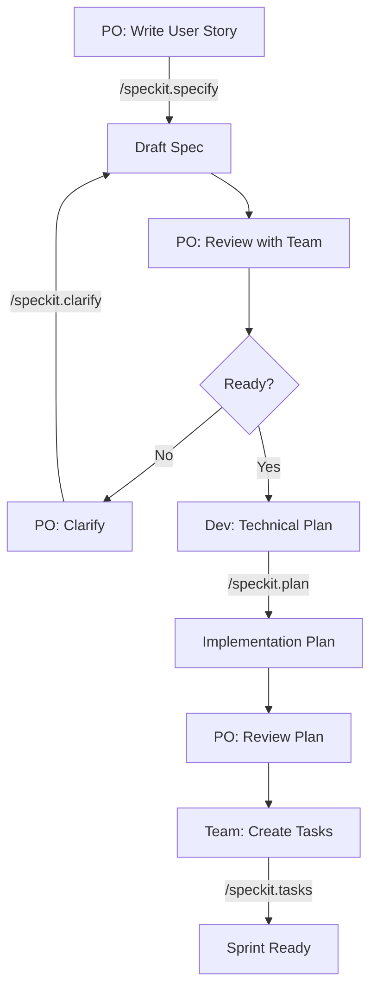

# GitHub Copilot Product Owner Guide

A comprehensive guide for Product Owners to leverage GitHub Copilot for backlog management, user story creation, acceptance criteria definition, and sprint planning.

## Table of Contents

- [Overview](#overview)
- [Backlog Management](#backlog-management)
- [User Story Excellence](#user-story-excellence)
- [Acceptance Criteria Mastery](#acceptance-criteria-mastery)
- [Sprint Planning Support](#sprint-planning-support)
- [Stakeholder Alignment](#stakeholder-alignment)
- [Real-World Scenarios](#real-world-scenarios)
- [Customizations & Tips](#customizations--tips)

## Overview

As a Product Owner, GitHub Copilot empowers you to:

- **Manage backlogs efficiently**: Prioritize, groom, and maintain healthy backlogs
- **Write better user stories**: Clear, valuable, and independently testable stories
- **Define acceptance criteria**: Precise conditions for "done"
- **Plan sprints effectively**: Right-sized work with clear goals
- **Align stakeholders**: Communicate value and progress clearly

## Backlog Management

### Generating Backlog Items from Ideas

```
@workspace "Convert these feature ideas into backlog items:
1. Users want to export reports to PDF
2. Need better search functionality
3. Mobile app crashes on slow connections
4. Admins need bulk user import
For each, provide: title, description, value statement, and rough size"
```

**Copilot generates**:

```markdown
## Backlog Items

### BL-001: PDF Report Export
**Title:** Export Reports to PDF Format

**Description:**
As a business user, I need to export dashboard reports to PDF format 
so that I can share insights with stakeholders who don't have system access.

**Value Statement:**
Reduces time spent on manual report creation by 80%, enables offline 
sharing with executives and clients.

**Size:** Medium (5-8 story points)
**Priority:** High - frequent customer request

---

### BL-002: Enhanced Search Functionality
**Title:** Implement Advanced Search with Filters

**Description:**
As any user, I need advanced search capabilities with filters 
so that I can quickly find specific items in large datasets.

**Value Statement:**
Improves user productivity by reducing search time from minutes to seconds,
especially valuable for power users with 1000+ items.

**Size:** Large (8-13 story points)
**Priority:** High - impacts daily workflow

---

### BL-003: Mobile Offline Handling
**Title:** Improve Mobile App Network Resilience

**Description:**
As a mobile user, I need the app to handle poor network conditions gracefully
so that I can continue working without losing data or experiencing crashes.

**Value Statement:**
Eliminates crash-related support tickets (currently 15% of mobile issues),
improves app store rating from 3.2 to 4.0+.

**Size:** Medium (5-8 story points)
**Priority:** Critical - impacts user retention

---

### BL-004: Bulk User Import
**Title:** Admin Bulk User Import via CSV

**Description:**
As an admin, I need to import multiple users from a CSV file
so that I can onboard large teams efficiently during initial setup.

**Value Statement:**
Reduces enterprise onboarding time from days to hours,
critical for closing enterprise deals with 100+ user organizations.

**Size:** Small (3-5 story points)
**Priority:** Medium - enterprise feature request
```

### Backlog Prioritization

```
@workspace "Help prioritize this backlog using value vs effort matrix:
- PDF Export: High value, Medium effort
- Advanced Search: High value, High effort
- Mobile Stability: Critical value, Medium effort
- Bulk Import: Medium value, Low effort
Recommend sprint order and groupings"
```

**Copilot generates**:

```markdown
## Value vs Effort Prioritization Matrix

```
        High Value
            │
    ┌───────┼───────┐
    │ Quick │ Major │
    │ Wins  │ Bets  │
    │       │       │
    │ [PDF] │[Search]│
────┼───────┼───────┼────
    │ Fill  │ Money │
    │ Ins   │ Pits  │
    │       │       │
    │[Bulk] │       │
    └───────┼───────┘
            │
        Low Value

   Low Effort → High Effort
```

**Note:** Mobile Stability is CRITICAL (not shown - goes above matrix)

## Recommended Priority Order

### 🔴 Sprint N (Immediate)
1. **Mobile Stability** - Critical bug affecting retention
   - Cannot delay - impacts revenue

### 🟡 Sprint N+1
2. **Bulk Import** - Quick win, low effort
   - Unblocks enterprise sales
3. **PDF Export** - High value, medium effort
   - Frequent customer request

### 🟢 Sprint N+2
4. **Advanced Search** - High value but high effort
   - Plan as epic across 2 sprints
   - Break into smaller deliverables

## Grouping Recommendations

| Theme | Items | Sprint Allocation |
|-------|-------|-------------------|
| Stability | Mobile fixes | N |
| Enterprise | Bulk Import | N+1 |
| User Experience | PDF, Search | N+1, N+2 |
```

### Backlog Grooming

```
@workspace "Review this user story for grooming:
'As a user, I want to see my data in different ways'
Identify issues and suggest improvements following INVEST criteria"
```

**Copilot analysis**:

```markdown
## Story Grooming Analysis

### Original Story
> "As a user, I want to see my data in different ways"

### INVEST Criteria Check

| Criterion | Status | Issue |
|-----------|--------|-------|
| Independent | ⚠️ Unclear | What data? What dependency? |
| Negotiable | ❌ Fail | Too vague for negotiation |
| Valuable | ⚠️ Unclear | Value not articulated |
| Estimable | ❌ Fail | Cannot estimate "different ways" |
| Small | ❌ Fail | Could be massive in scope |
| Testable | ❌ Fail | No clear acceptance criteria |

### Issues Identified

1. **Vague persona**: "user" - which user type?
2. **Unclear scope**: "my data" - all data? specific data?
3. **Ambiguous goal**: "different ways" - charts? tables? filters?
4. **Missing value**: Why do they need this?

### Suggested Improvements

Break into multiple specific stories:

**Story 1: Data Visualization**
> As a **sales manager**, I want to view my team's performance data as charts
> So that I can quickly identify trends and outliers during weekly reviews

**Story 2: Data Filtering**
> As a **data analyst**, I want to filter report data by date range and category
> So that I can focus on specific segments for detailed analysis

**Story 3: Data Export**
> As a **finance user**, I want to export my transaction data to Excel
> So that I can perform custom analysis using my existing tools

### Each improved story is:
- ✅ Independent - Can be built separately
- ✅ Negotiable - Clear scope for discussion
- ✅ Valuable - Business reason stated
- ✅ Estimable - Specific enough to size
- ✅ Small - Single sprint deliverable
- ✅ Testable - Clear conditions for done
```

## User Story Excellence

### Creating INVEST-Compliant Stories

```
@workspace "Create user stories for a shopping cart feature:
- Add items to cart
- Update quantities
- Remove items
- Save cart for later
- Apply discount codes
Follow INVEST principles with full acceptance criteria"
```

**Copilot generates**:

```markdown
## Shopping Cart User Stories

### US-SC-001: Add Items to Cart
**As a** shopper browsing products
**I want to** add items to my shopping cart
**So that** I can collect items for purchase without losing my selections

**Value:** Enables core e-commerce functionality, prerequisite for all purchases

**Acceptance Criteria:**
```gherkin
Scenario: Add single item to empty cart
  Given I am viewing a product page
  And my cart is empty
  When I click "Add to Cart"
  Then the item should appear in my cart
  And the cart icon should show "1 item"
  And I should see a confirmation message

Scenario: Add item already in cart
  Given I have "Blue T-Shirt" in my cart (qty: 1)
  When I add another "Blue T-Shirt" from the product page
  Then my cart should show "Blue T-Shirt" with qty: 2
  And the cart total should update accordingly

Scenario: Add item when not logged in
  Given I am not logged in
  When I add an item to cart
  Then the item should be added to a guest cart
  And the cart should persist for 7 days via cookie
```

**Definition of Done:**
- [ ] Unit tests pass with 90%+ coverage
- [ ] E2E test covers happy path
- [ ] Cart persists across page refreshes
- [ ] Analytics event fires on add

**Story Points:** 5

---

### US-SC-002: Update Cart Quantities
**As a** shopper with items in my cart
**I want to** change the quantity of items
**So that** I can buy more or fewer of each item without removing and re-adding

**Value:** Reduces friction in purchase flow, improves conversion rate

**Acceptance Criteria:**
```gherkin
Scenario: Increase quantity
  Given I have "Blue T-Shirt" (qty: 1) in my cart
  When I change the quantity to 3
  Then the cart should show qty: 3
  And the subtotal should update to 3x the unit price

Scenario: Decrease quantity to minimum
  Given I have "Blue T-Shirt" (qty: 3) in my cart
  When I change the quantity to 1
  Then the cart should show qty: 1
  And I should NOT see a remove confirmation

Scenario: Exceed available inventory
  Given "Blue T-Shirt" has 5 units in stock
  When I try to set quantity to 10
  Then I should see "Only 5 available"
  And the quantity should be set to 5

Scenario: Invalid quantity input
  Given I have items in my cart
  When I enter a negative number or non-numeric value
  Then the input should be rejected
  And the previous valid quantity should remain
```

**Story Points:** 3

---

### US-SC-003: Remove Items from Cart
**As a** shopper who changed my mind
**I want to** remove items from my cart
**So that** I only purchase what I actually want

**Acceptance Criteria:**
```gherkin
Scenario: Remove single item
  Given I have 3 items in my cart
  When I click the remove button on one item
  Then that item should be removed
  And I should see 2 items remaining
  And I should see an "Undo" option for 10 seconds

Scenario: Remove last item
  Given I have 1 item in my cart
  When I remove that item
  Then my cart should be empty
  And I should see "Your cart is empty"
  And I should see "Continue shopping" link

Scenario: Undo removal
  Given I just removed "Blue T-Shirt"
  When I click "Undo" within 10 seconds
  Then "Blue T-Shirt" should be restored to my cart
  With the same quantity as before
```

**Story Points:** 3

---

### US-SC-004: Save Cart for Later
**As a** shopper who isn't ready to buy
**I want to** save my cart for later
**So that** I can return and complete my purchase without starting over

**Acceptance Criteria:**
```gherkin
Scenario: Save cart as logged-in user
  Given I am logged in with items in my cart
  When I click "Save for Later"
  Then my cart items should be saved to my account
  And I should see confirmation "Cart saved"

Scenario: Retrieve saved cart
  Given I saved a cart 3 days ago
  When I log in and view my account
  Then I should see "Saved Cart" option
  And clicking it should restore those items

Scenario: Save cart prompt for guest
  Given I am not logged in
  And I have items in my cart
  When I click "Save for Later"
  Then I should be prompted to log in or create account
  And after login, my cart should be saved

Scenario: Merge saved and current cart
  Given I have a saved cart with items A, B
  And my current cart has items B, C
  When I restore my saved cart
  Then I should be asked how to handle duplicates
  And see options: "Keep both", "Replace current", "Cancel"
```

**Story Points:** 8

---

### US-SC-005: Apply Discount Codes
**As a** shopper with a discount code
**I want to** apply it to my cart
**So that** I can receive the promised discount on my purchase

**Acceptance Criteria:**
```gherkin
Scenario: Apply valid percentage discount
  Given my cart total is $100
  And I have a valid "20OFF" code for 20% off
  When I apply the code
  Then I should see "-$20.00" discount line
  And new total should be $80.00
  And I should see "20OFF applied" confirmation

Scenario: Apply invalid code
  Given I have items in my cart
  When I enter an invalid code "FAKECODE"
  Then I should see "Invalid discount code"
  And my cart total should remain unchanged

Scenario: Apply expired code
  Given I have a code that expired yesterday
  When I try to apply it
  Then I should see "This code has expired"
  And be shown current valid promotions if any

Scenario: Code with minimum purchase
  Given I have a code requiring $50 minimum
  And my cart total is $40
  When I apply the code
  Then I should see "Add $10 more to use this code"
  And the code should not be applied

Scenario: Only one code allowed
  Given I already have a code applied
  When I try to apply another code
  Then I should see "Only one discount code allowed"
  And be given option to replace existing code
```

**Story Points:** 5
```

### Story Splitting Techniques

```
@workspace "This story is too large - help me split it:
'As an admin, I want to manage all user accounts including 
creating, editing, deleting, assigning roles, resetting passwords,
viewing activity logs, and managing permissions'"
```

**Copilot suggests splits**:

```markdown
## Story Splitting Analysis

### Original Epic (Too Large)
> Admin user management with CRUD, roles, passwords, logs, permissions

**Estimated Size:** 40+ story points (needs splitting!)

### Recommended Splits

Use **Workflow Steps** splitting pattern:

#### Sprint 1: Core CRUD (Foundation)
| Story | Points | Dependencies |
|-------|--------|--------------|
| US-1: View user list | 3 | None |
| US-2: Create new user | 5 | US-1 |
| US-3: Edit user details | 3 | US-1 |
| US-4: Delete/deactivate user | 3 | US-1 |

**Sprint Goal:** Basic user management operational

#### Sprint 2: Security Features
| Story | Points | Dependencies |
|-------|--------|--------------|
| US-5: Reset user password | 3 | US-2 |
| US-6: Force password change | 2 | US-5 |
| US-7: View user activity log | 5 | US-1 |

**Sprint Goal:** Security controls in place

#### Sprint 3: Access Control
| Story | Points | Dependencies |
|-------|--------|--------------|
| US-8: Assign roles to users | 5 | US-3 |
| US-9: Create custom roles | 5 | US-8 |
| US-10: Manage permissions | 8 | US-9 |

**Sprint Goal:** Full RBAC implemented

### Alternative Splitting Approaches

**By User Type:**
- Super Admin stories (full access)
- Team Admin stories (limited scope)
- Self-service stories (own account)

**By Data Complexity:**
- Single user operations
- Bulk operations
- Import/export operations

**By Risk Level:**
- Read-only operations first
- Reversible changes second
- Destructive operations last
```

## Acceptance Criteria Mastery

### Writing Testable Criteria

```
@workspace "Improve these vague acceptance criteria:
Original: 'System should be fast'
Original: 'User can manage their profile'
Original: 'Data should be secure'"
```

**Copilot improves**:

```markdown
## Acceptance Criteria Improvements

### ❌ Original: "System should be fast"

### ✅ Improved: Performance Requirements

```gherkin
Scenario: Page load performance
  Given a user on a standard broadband connection (10 Mbps)
  When they navigate to any page in the application
  Then the page should be interactive within 2 seconds
  And fully loaded within 4 seconds

Scenario: Search response time
  Given a database with 100,000+ records
  When a user performs a search query
  Then results should appear within 500 milliseconds

Scenario: Bulk operation performance
  Given an admin processing 1,000 records
  When they initiate a bulk update
  Then a progress indicator should appear immediately
  And the operation should complete within 30 seconds
  And the user should be notified upon completion
```

---

### ❌ Original: "User can manage their profile"

### ✅ Improved: Profile Management

```gherkin
Scenario: View profile information
  Given I am logged in
  When I navigate to My Profile
  Then I should see my name, email, phone, and avatar
  And I should see my account creation date
  And I should see my last login timestamp

Scenario: Update display name
  Given I am on my profile page
  When I change my display name to "Jane Smith"
  And click Save
  Then my profile should show "Jane Smith"
  And the header should update to show "Jane Smith"
  And I should see "Profile updated" confirmation

Scenario: Update email with verification
  Given I am on my profile page
  When I change my email to "new@example.com"
  Then a verification email should be sent to new@example.com
  And my old email should remain active until verified
  And I should see instructions to verify

Scenario: Upload profile photo
  Given I am on my profile page
  When I upload a 2MB JPEG image
  Then the image should be resized to 200x200
  And displayed as my new avatar
  And the old avatar should be replaced

Scenario: Attempt invalid photo upload
  Given I am on my profile page
  When I try to upload a 10MB file
  Then I should see "File too large (max 5MB)"
  And my current avatar should remain unchanged
```

---

### ❌ Original: "Data should be secure"

### ✅ Improved: Security Requirements

```gherkin
Scenario: Password storage
  Given a user creates an account
  When their password is stored
  Then it must be hashed using bcrypt with cost factor 12
  And the original password must never be logged or stored

Scenario: Session security
  Given a user is logged in
  When they are inactive for 30 minutes
  Then their session should expire
  And they should be redirected to login
  And see message "Session expired for your security"

Scenario: Sensitive data transmission
  Given any page transmitting user data
  When data is sent between client and server
  Then all communication must use HTTPS/TLS 1.2+
  And sensitive fields must not appear in URLs

Scenario: Failed login protection
  Given 5 consecutive failed login attempts
  When the 6th attempt is made
  Then the account should be locked for 15 minutes
  And an email should be sent to the account owner
  And a security log entry should be created

Scenario: Data access logging
  Given an admin accesses user personal data
  When they view, edit, or export that data
  Then an audit log entry must be created
  Including: admin ID, action, timestamp, affected user
```

### Edge Case Identification

```
@workspace "Identify edge cases for this story:
'As a user, I want to upload documents to my project'"
```

**Copilot identifies**:

```markdown
## Edge Cases: Document Upload

### File Type Edge Cases
- What file types are allowed? (Define whitelist)
- What happens with disguised file extensions (.pdf.exe)?
- How to handle files with no extension?
- What about uncommon but valid types (.webp, .heic)?

### File Size Edge Cases
- Maximum file size? (e.g., 50MB)
- What happens at exactly the limit?
- How to handle 0-byte files?
- Message for oversized files?

### File Name Edge Cases
- Very long file names (255+ characters)
- Special characters in name (ñ, 日本語, emoji 📄)
- Spaces and punctuation
- Duplicate file names
- Reserved names (CON, PRN on Windows)

### Upload Process Edge Cases
- Network disconnection mid-upload
- Browser tab closed during upload
- Multiple files selected (if allowed)
- Drag-and-drop vs file picker
- Mobile vs desktop behavior

### Storage Edge Cases
- User's storage quota full
- Project storage limit reached
- Concurrent uploads from same user
- File already exists with same name

### Permission Edge Cases
- User loses project access during upload
- Project archived mid-upload
- Upload to read-only project

### Acceptance Criteria for Edge Cases

```gherkin
Scenario: File type not allowed
  Given I try to upload an .exe file
  Then I should see "File type not allowed"
  And see list of accepted file types
  And the file should not be uploaded

Scenario: Network failure during upload
  Given I am uploading a file
  When my network connection drops
  Then I should see "Upload failed - network error"
  And be offered "Retry" button
  And partial upload should be cleaned up

Scenario: Duplicate filename
  Given "report.pdf" exists in my project
  When I upload another "report.pdf"
  Then I should be asked to "Replace" or "Keep both"
  And "Keep both" should rename to "report (1).pdf"
```
```

## Sprint Planning Support

### Sprint Goal Creation

```
@workspace "Help create sprint goals for these selected stories:
- US-101: User login with SSO
- US-102: Password reset flow
- US-103: Session management
- US-104: Login activity dashboard
Theme: Authentication improvements"
```

**Copilot generates**:

```markdown
## Sprint Goal Options

### Option 1: User-Focused Goal
> **"Users can securely access their accounts with enterprise SSO 
> and have full visibility into their login activity"**

**Why this works:**
- Focuses on user value, not tasks
- Measurable outcome (SSO login works, dashboard visible)
- Inspires the team toward a cohesive experience

### Option 2: Business-Focused Goal
> **"Complete the authentication upgrade to unblock enterprise sales 
> requiring SSO compliance"**

**Why this works:**
- Ties to business objective
- Clear success criteria (enterprise ready)
- Prioritizes SSO as the key deliverable

### Option 3: Technical-Focused Goal
> **"Establish secure, scalable authentication foundation supporting 
> SSO, password management, and session handling"**

**Why this works:**
- Emphasizes architectural completeness
- Sets up for future enhancements
- Appropriate if technical debt is a concern

## Recommended Sprint Structure

```
Week 1: Foundation
├── US-103: Session management (prerequisite)
└── US-102: Password reset flow

Week 2: Core Features
├── US-101: SSO integration
└── US-104: Login activity dashboard

Buffer: 
└── Bug fixes and polish
```

## Definition of Done for Sprint

- [ ] All stories meet acceptance criteria
- [ ] Security review completed
- [ ] Documentation updated
- [ ] Stakeholder demo delivered
- [ ] No critical bugs in authentication flow
```

### Capacity Planning

```
@workspace "Calculate sprint capacity:
Team: 3 developers (40 hrs each), 1 designer (20 hrs shared)
Sprint: 2 weeks (10 working days)
Ceremonies: 8 hours per person
Expected velocity: 40 story points
Stories to fit: 45 points in backlog"
```

**Copilot calculates**:

```markdown
## Sprint Capacity Analysis

### Available Hours

| Role | People | Hrs/Person | Total |
|------|--------|------------|-------|
| Developers | 3 | 40 | 120 hrs |
| Designer | 1 | 20 | 20 hrs |
| **Total** | 4 | - | **140 hrs** |

### Deductions

| Item | Hours |
|------|-------|
| Ceremonies (4 people × 8 hrs) | 32 hrs |
| Buffer for bugs/support (10%) | 14 hrs |
| **Total Deductions** | **46 hrs** |

### Net Capacity

| Metric | Value |
|--------|-------|
| Gross hours | 140 hrs |
| Deductions | 46 hrs |
| **Net capacity** | **94 hrs** |

### Story Point Conversion

| Metric | Calculation | Value |
|--------|-------------|-------|
| Historical velocity | Given | 40 pts/sprint |
| Net hours available | Calculated | 94 hrs |
| Hours per point | 94 ÷ 40 | ~2.4 hrs/pt |

### Backlog Fit Analysis

| Scenario | Points | Hours Needed | Fits? |
|----------|--------|--------------|-------|
| Full backlog | 45 pts | 108 hrs | ❌ No |
| 85% backlog | 38 pts | 91 hrs | ✅ Yes |
| Conservative | 35 pts | 84 hrs | ✅ Yes |

### Recommendations

1. **Commit to 38 points** (85% of backlog)
   - Leaves 3 hrs buffer
   - Achievable with minor overrun risk

2. **Stretch goal: 45 points**
   - Would require overtime or scope reduction
   - Not recommended

3. **Stories to defer:**
   - Move lowest priority ~7 points to next sprint
   - Identify stories that can be split
```

## Stakeholder Alignment

### Demo Scripts

```
@workspace "Create demo script for sprint review:
Features completed:
- New dashboard with widgets
- Export to PDF functionality
- Mobile responsive design
Audience: Product leadership, Customer success, Engineering leads
Duration: 15 minutes"
```

**Copilot generates**:

```markdown
## Sprint Review Demo Script

### Setup (2 min before demo)
- [ ] Clear browser cache
- [ ] Log in as demo user "demo@company.com"
- [ ] Pre-populate some sample data
- [ ] Have mobile device ready (or device emulator)
- [ ] PDF viewer installed

---

### Introduction (1 min)
"Welcome to Sprint 23 review! This sprint focused on user experience 
improvements. Let me show you what the team delivered..."

**Key message:** User productivity improvements

---

### Demo 1: New Dashboard (5 min)

**Narrative:** "Let's start with our redesigned dashboard..."

1. **Show default view**
   - Point out widget layout
   - "Notice the key metrics are now front and center"

2. **Demonstrate customization**
   - Drag a widget to new position
   - Resize the chart widget
   - "Users can personalize their view"

3. **Show saved layouts**
   - Switch between "Overview" and "Details" layouts
   - "Power users can save multiple layouts"

**Talking points:**
- 40% increase in session duration in beta
- Top 3 customer-requested feature
- Zero training required

---

### Demo 2: PDF Export (4 min)

**Narrative:** "A frequently requested feature - report export..."

1. **Navigate to reports**
   - Show a sample report
   - "Previously, users had to screenshot reports"

2. **Export to PDF**
   - Click Export → PDF
   - Show format options
   - "Professional formatting, ready to share"

3. **Open generated PDF**
   - Show quality of output
   - Point out branding/headers

**Talking points:**
- Eliminates manual report creation
- Includes proper page breaks
- Respects user's filter selections

---

### Demo 3: Mobile Experience (3 min)

**Narrative:** "Finally, our mobile users get a better experience..."

1. **Show mobile view** (device or emulator)
   - Navigate dashboard on mobile
   - "Fully responsive, not just shrunken"

2. **Touch interactions**
   - Swipe between widgets
   - Tap to expand charts

3. **Compare before/after**
   - Show screenshot of old mobile view
   - "Night and day difference"

---

### Wrap-up (2 min)

**Metrics achieved:**
- 40% longer session duration
- 25% reduction in "report" support tickets
- 4.5★ beta feedback

**Next sprint preview:**
- Performance optimizations
- Advanced filtering

**Questions?**

---

### Backup Scenarios

If something fails:
- Dashboard not loading → Use screenshots
- PDF generation slow → Show pre-generated PDF
- Mobile emulator issues → Use screenshots
```

### Progress Reporting

```
@workspace "Generate sprint progress report:
Sprint: 23 of 26 (Q4)
Completed: 35 of 42 story points
Blocked: 2 stories (waiting on API from partner)
At risk: 1 story (design not finalized)
Format for leadership weekly update"
```

## Real-World Scenarios

### Scenario 1: Sprint Planning with Copilot

```bash
# Before sprint planning session

# 1. Review and groom backlog items
@workspace "Review top 10 backlog items for sprint readiness:
- Check INVEST criteria
- Identify missing acceptance criteria
- Flag items needing clarification"

# 2. Estimate capacity
@workspace "Calculate sprint capacity with:
- Team of 5 developers
- 1 on vacation for 3 days
- 2 days company-wide meetings"

# 3. Select sprint backlog
@workspace "Given 30 point capacity, select optimal stories from:
[list of stories with points and dependencies]"

# 4. Create sprint goal
@workspace "Create sprint goal that ties selected stories together"
```

### Scenario 2: Handling Scope Changes

```
@workspace "A stakeholder requests adding 'social login' mid-sprint:
- Current sprint: 5 days remaining, 8 points uncommitted
- New request estimated: 5-8 points
- Priority: High (blocks enterprise deal)

Provide options and recommendations"
```

**Copilot analyzes**:

```markdown
## Mid-Sprint Scope Change Analysis

### Current State
- Days remaining: 5
- Uncommitted capacity: ~8 points
- New request: 5-8 points (social login)

### Options Analysis

#### Option 1: Accept Full Scope
**Action:** Add social login, remove equivalent uncommitted work

| Pros | Cons |
|------|------|
| Addresses business need | Disrupts sprint |
| Shows flexibility | Deferred work impacts roadmap |

**Risk:** Medium - if estimate is wrong, sprint fails

#### Option 2: Negotiate Minimal Scope
**Action:** Implement Google OAuth only (not full social login)

| Pros | Cons |
|------|------|
| Reduces risk | May not fully satisfy stakeholder |
| Fits capacity better | Technical debt possible |

**Estimated scope:** 3-4 points for Google only

#### Option 3: Start Next Sprint
**Action:** Defer to Sprint 24, prioritize as #1

| Pros | Cons |
|------|------|
| Protects current sprint | 2-week delay |
| Proper planning | Stakeholder may push back |

### Recommendation

**Option 2: Negotiate Minimal Scope**

Implement Google OAuth this sprint as "MVP social login":
1. Satisfies immediate enterprise need
2. Fits remaining capacity
3. Full social login (Apple, Microsoft) in Sprint 24

### Communication Template

> "We can deliver Google OAuth login this sprint, which covers 80% 
> of enterprise use cases. Full social login suite will follow 
> in Sprint 24. Does this address your immediate need?"
```

### Scenario 3: Stakeholder Alignment Session

```
@workspace "Prepare for quarterly roadmap review with executive team:
- Q1 delivered: 85% of planned features
- Q2 plan: Performance, Enterprise features, Mobile
- Risks: Engineering capacity, Competitor moves
- Asks: Additional headcount, Extended timeline for mobile"
```

## Customizations & Tips

### PO-Specific Copilot Instructions

```markdown
# PO Copilot Instructions

## User Story Format
- Always follow: As a [user], I want [goal], So that [benefit]
- Include 3-5 acceptance criteria minimum
- Use Gherkin format for complex scenarios

## Prioritization
- Default to MoSCoW framework
- Always state business value justification
- Consider technical dependencies

## Communication Style
- Stakeholder updates: High-level, metric-focused
- Team communication: Detailed, actionable
- Documentation: Comprehensive but scannable
```

### Useful Prompts for POs

| Task | Prompt |
|------|--------|
| Story creation | "Create user story for [feature] following INVEST principles" |
| Acceptance criteria | "Write testable acceptance criteria using Gherkin for [feature]" |
| Story splitting | "This story is too large - suggest splits using [pattern]" |
| Sprint goal | "Create sprint goal connecting these stories: [list]" |
| Progress report | "Generate sprint progress report for [audience]" |
| Capacity planning | "Calculate sprint capacity given [team details]" |

### Collaboration Patterns



---

[Back to Cookbook](../README.md) | [PM Guide](./pm-guide.md) | [Engineering Lead Guide](./engineering-lead-guide.md)
